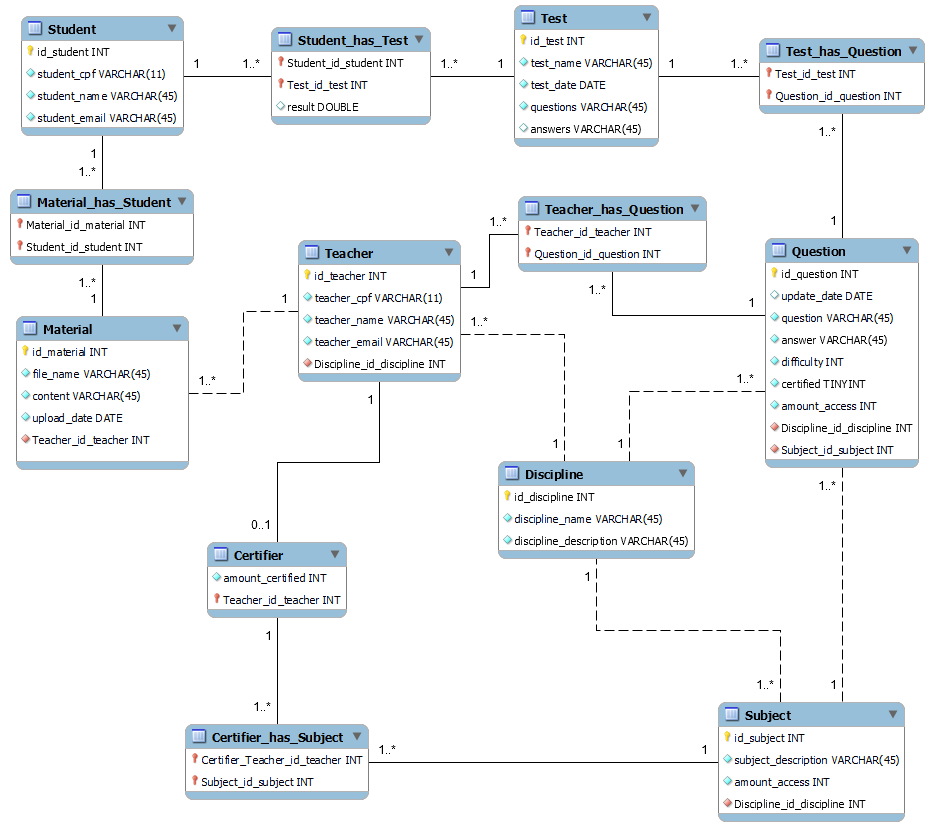

[](https://opensource.org/licenses/MIT)
## Sistema de banco de questões

- [Sistema de banco de questões](#sistema-de-banco-de-questões)
- [Descrição da narrativa](#descrição-da-narrativa)
  - [Requisitos gerais do projeto](#requisitos-gerais-do-projeto)
  - [Requisitos específicos do projeto](#requisitos-específicos-do-projeto)
- [Diagramas](#diagramas)
- [Design - Visual do Frontend](#design---visual-do-frontend)
  - [Prototipos de telas (inicial)](#prototipos-de-telas-inicial)
- [Pré-requisito](#pré-requisito)
- [Instruções para compilar e executar o projeto](#instruções-para-compilar-e-executar-o-projeto)
  - [Conexão com o banco de dados](#conexão-com-o-banco-de-dados)
  - [Compilar e executar o projeto](#compilar-e-executar-o-projeto)
  - [Instruções para visualizar, filtrar, selecionar e gerar provas](#instruções-para-visualizar-filtrar-selecionar-e-gerar-provas)
- [Roadmap/Backlog/TODO LIST do projeto](#roadmapbacklogtodo-list-do-projeto)
- [Contatos](#contatos)
- [Licença](#licença)

## Descrição da narrativa

O Banco de questões deve permitir visualizar, filtrar, selecionar, e gerar provas com as questões classificadas das principais matérias e atualizadas constantemente. Nele, os atores Alunos, professores e certificadores (um tipo específico de professor) constroem, avaliam e testam materiais e questões.

O sistema é dividido em quatro partes, todas independentes entre si, e que permitam a interação entre professores e alunos. O primeiro módulo gerencia e armazena questões. As questões armazenadas não ficam disponíveis de imediato para compor as provas. É necessário que passem por uma moderação por certificadores (professores que no seu perfil estejam alinhados com o assunto da questão) para que as mesmas possam compor as provas no sistema. O segundo módulo elabora as provas com base em parâmetros indicados pelo aluno, de forma aleatória (questões e itens) e armazena a estrutura da prova com a sua respectiva pontuação. Observe que este segundo módulo somente monta a prova. O terceiro módulo é o de aplicação de provas propriamente dito. E o último módulo é um módulo de estatísticas e desempenho de aluno que também indica materiais da curadoria para consumo.

Ademais, o primeiro módulo, o de armazenamento de questões, também é responsável por ter funções de busca com bases nos filtros das questões.


### Requisitos gerais do projeto

- [ ] Precisa ter uma página inicial institucional estática, a página inicial;
- [ ] Demais páginas precisam ser dinâmicas e abordar os casos de uso;
- [ ] Ser responsivo, ter pontos de quebra para celular e Desktop;
- [ ] Identidade visual com palheta de cores (até 05) e fontes;
- [ ] Possuir controle de acesso de usuários;
- [ ] Ter entre 05 e 10 componentes distintos do Bootstrap. Entende-se como componentes tudo da seção Components;
- [ ] Diagrama Entidade-Relacionamento do banco de dados;
- [ ] O sistema precisa ter autenticação de usuários.

### Requisitos específicos do projeto

- [ ] Fazer cadastro de aluno, professores e certificadores;
- [ ] Professores cadastram questões de escolha única, múltipla escolha;
- [ ] Professores podem cadastrar material de estudo (PDFs);
- [ ] Professores podem enviar para certificação questões e materiais de estudo;
- [ ] Alunos podem baixar material de estudo;
- [ ] Alunos podem responder provas geradas com base nos assuntos de interesse;
- [ ] Alunos podem acessar seu desempenho;
- [ ] Certificadores podem aprovar ou desaprovar questões e materiais de estudo;
- [ ] É possível classificar as questões e materiais por categorias (tags) e fazer busca dos mesmos no sistema;
Mostrar materiais e assuntos mais acessados.

## Diagramas

Os seguintes diagramas são a versão definida inicialmente para modelagem do projeto. Não está fidedigno com a implementação. Será atualizado posteriormente.

<details>
<summary>Diagrama de classe</summary>
<br>

  

</details>

<details>
<summary>Diagrama entidade relacionamento</summary>
<br>

    

</details>


## Design - Visual do Frontend

### Prototipos de telas (inicial)

Conseguimos prototipar algumas telas para definirmos alguns escopos de trabalho. 

Para isso, utilizamos o Figma para criar alguns modelos de telas e termos uma base inicial. 

No diretório `telas`, é possível visualizar todas as telas em um *único PDF*. Para acessar diretamente o arquivo, basta clicar [aqui](front-end/telas/Telas.pdf).

> Também é possível acessar os protótipos diretamente pelo Figma através do link: https://www.figma.com/file/CkA8G5aU1pIcOs4t75UNZd/Untitled?node-id=0%3A1&t=LTUyff4CvEg1euWd-1


## Pré-requisito

* npm (react)
* Java 17+ (mvn)
* Oracle Database
* Docker (Opcional)

## Instruções para compilar e executar o projeto

### Conexão com o banco de dados

<!-- % FIXME[Renan] Ajustar depois -->

Subir o Oracle *database* utilizando Docker [images](https://hub.docker.com/r/gvenzl/oracle-xe)

> Caso tenha o banco de dados instalado na máquina, não é necessário usar o Docker

```
docker run -d -p 1521:1521 -e ORACLE_PASSWORD=<password> -v <pwd>:/opt/oracle/oradata gvenzl/oracle-xe
```

Após a primeira inicialização, é recomendado *resetar* o *password* do usuário `SYS` e `SYSTEM` conforme passo abaixo
```
docker exec <container ID> resetPassword <password>
```

Com o container em execução, é recomendado utilizar a ferramenta de gerenciamento de banco de dados [Oracle SQL Developer](https://www.oracle.com/database/sqldeveloper/) para acessar o *database* instanciado com o Docker para visualizar as tabelas.

A configuração para a aplicação acessar o banco de dados deve ser feita no arquivo [application.properties](src/main/resources/application.properties) conforme o exemplo abaixo:

```properties
spring.jpa.show-sql=true
spring.jpa.properties.hibernate.format_sql=true

spring.jpa.database-platform=org.hibernate.dialect.Oracle12cDialect
spring.jpa.hibernate.ddl-auto=create

spring.datasource.url=jdbc:oracle:thin:@localhost:1521:xe
spring.datasource.username=youruser
spring.datasource.password=yourpassword

```
> É recomendado criar um novo usuário para rodar a aplicação, ao invés de usar o usuário padrão SYSTEM

### Compilar e executar o projeto

1. Clonar o repositório com o comanbo abaixo:

```bash
  git clone https://github.com/giovannicurcuruto/phillips-BdQ.git
```

2. Para iniciar o back-end é necessário os seguintes passos:

```bash
  cd back-end
  mvn clean install
  java -jar target/banco-questoes-0.0.1-SNAPSHOT.jar
```


1. Para iniciar o front-end, em um novo terminal, é necessário os seguintes passos:

```bash
  cd front-end
  npm install
  npm start
```

4. Após a instalação/execução, as seguintes URLs estarão disponíveis para serem acessadas.

| Application | URL                                   | Credentials                                         |
| ----------- | ------------------------------------- | --------------------------------------------------- |
| back-end    | http://localhost:8080/swagger-ui.html | `renan/123`, `giovani/123` ou criar um novo         |
| front-end   | http://localhost:3000                 | `renan/123`, `giovani/123` ou criar um novo         |


> O projeto utiliza a biblioteca [springdoc-openapi](https://springdoc.org/v2/) para geração da documentação da API.

### Instruções para visualizar, filtrar, selecionar e gerar provas 

## Roadmap/Backlog/TODO LIST do projeto

Criamos um quadro no Trello, para controlar e planejar nossas demandas para projetarmos e prospectarmos de maneira mais eficiente nossas atividades. A nossa *"metodologia Agil"/Kanban/Scrum* está disponível [aqui](https://trello.com/b/PoC6jXiZ/ifce-banco-de-questões-todo)! 


## Contatos
<div> 
Renan Rodolfo da Silva

<a href = "mailto:rrenanrds@gmail.com"></a>
<a href="https://www.linkedin.com/in/renanrodolfo/" target="_blank"></a>   
</div>    

<div>
Giovanni Curcuruto

<a href = "mailto:ggcurcuruto@gmail.com"></a>
<a href="https://www.linkedin.com/in/giovanni-curcuruto-b6689596" target="_blank"></a>   
</div>    

## Licença

Licensed under the [MIT License](./LICENSE).